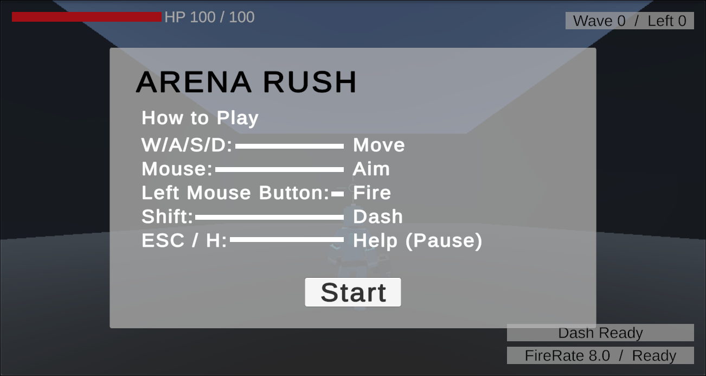
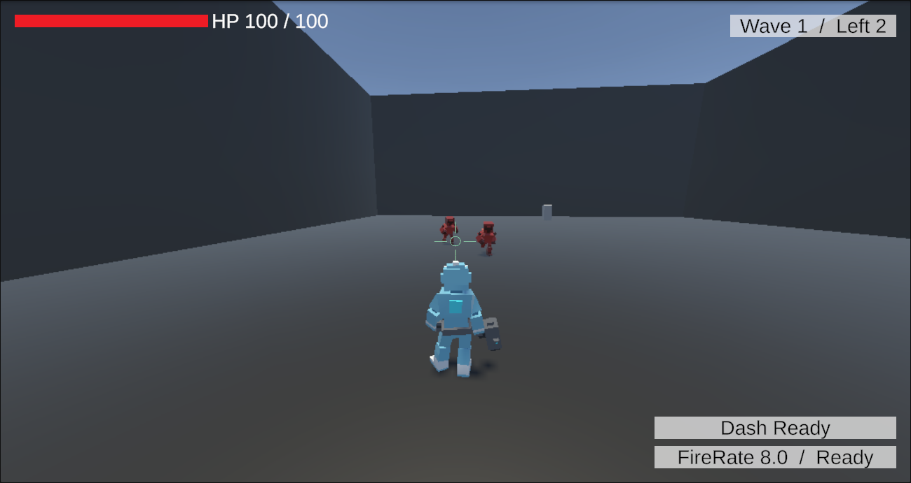

# **Arena Rush – 3D Action Shooter (Prototype)**

**Unity 기반 / 기능 우선 개발 / 아트 미적용 테스트 버전**

---

## Play URL
https://play.unity.com/ko/games/21778e20-4bf0-4088-92fa-dc3b4e019626/3d-shooting-arena-rush





## **1. 프로젝트 개요**

Arena Rush는 소형 아레나에서 몰려오는 적 웨이브를 가능한 한 빠르게 클리어하는 **3D 액션 슈팅 미니게임**이다. 짧은 세션, 즉각 반응성, 반복 플레이 루프를 목표로 설계되었다.

- **장르:** 3D Action Shooter · Wave Survival
- **카메라:** TPS Short Distance
- **플레이타임:** 3~5분
- **개발 목적:** 기능 프로토타입, 시스템 검증, 반복 플레이 설계 테스트

## 1-1. 개발 환경
- Unity 버전: Unity 6 (6000.x LTS)
- Render Pipeline: URP(Universal Render Pipeline) 고정

---

## **2. 핵심 컨셉**

- 좁은 아레나에서 빠른 전투
- 웨이브 진행 → 강화 선택 → 성장 → 다음 웨이브
- 즉각 입력 반응, 단순 UI, 명확한 피드백
- 최소 아트 기반 기능 검증 중심

---

## **3. 핵심 시스템 구성**

### **3.1 Player System**

- WASD 이동 / 마우스 조준
- 연사형 기본 사격
- Dash(쿨다운)
- HP / MoveSpeed / Damage / FireRate / DashCooldown
- Rigidbody 기반 이동

### **3.2 Weapon System**

- 기본 Gun 1종
- HitScan 기반 Raycast 탄환
- FireRate, Damage, Range 설정
- 총구 플래시·히트 스파크 최소 연출

### **3.3 Enemy System**

- 타입 2종
    - **Chaser:** 플레이어 추적
    - **Shooter:** 사거리 내 정지 후 원거리 공격
- 공통: Health, Collision, Attack Cooldown
- 스폰 포인트 9개, 웨이브별 스폰 개체 수 증가

### **3.4 Wave System**

- WaveConfig(ScriptableObject) 기반
- 웨이브 번호, 적 수, 타입 구성
- 남은 적 카운트 → 다음 웨이브 자동 전환
- 10웨이브 기준 기본 생존 난이도 조정

### **3.5 Perk System**

- 웨이브 종료 시 Perk 선택 UI 팝업
- Perk 예시
    - Damage +20%
    - Fire Rate +15%
    - Move Speed +10%
    - Max HP +30
    - Dash Cooldown -20%
- ScriptableObject 기반 정의 / 즉시 적용

### **3.6 UI / HUD**

- HP Bar
- Wave/남은 적 수
- Dash Cooldown
- Perk Popup(3종 중 1 선택)
- Game Over 화면(최고 웨이브 표시)

---

## **4. 기본 게임 루프**

1. 스테이지 로드
2. Wave 1 시작
3. 적 처리
4. 웨이브 종료 → Perk 선택
5. 다음 웨이브
6. 플레이어 HP 0 → Game Over
7. Restart

---

## **5. 개발 Todo (기능 우선 / 아트 없음)**

### **초기 우선순위(P1)**

- [x]  씬 구성 + 카메라 + 기본 바닥/벽
- [x]  Input Actions 설정
- [x]  Player 이동 / 조준 / 사격
- [x]  Health / Damage / Death 이벤트
- [x]  EnemyChaser 기본 AI
- [x]  WaveManager / 스폰 포인트
- [x]  Perk 시스템 / Perk 선택 UI
- [x]  HUD 구현
- [x]  GameState(Playing / PerkSelect / GameOver)

### **보강(P2)**

- [x]  Dash 기능
- [x]  EnemyShooter 구현
- [x]  ObjectPooler 구축
- [x]  기본 사운드 / 간단 파티클
- [ ]  Wave 밸런싱

### **후순위(P3)**

- [ ]  Boss(옵션)
- [ ]  다양한 무기(Shotgun, Laser 등)
- [ ]  Perk 확장
- [ ]  Arena Theme 적용
- [x]  세션 기록 저장

---

## **6. 폴더 구조**

```
Assets/
 └ _Game/
     ├ Animations/
     ├ Audio/
     ├ Materials/
     ├ Model/
     ├ Prefabs/
     ├ Scenes/
     ├ Scripts/
     │   ├ Core/
     │   │   └ Architecture/
     │   ├ Data/
     │   │   ├ Events/
     │   │   └ GameState/
     │   ├ Enemy/
     │   │   ├ Bruiser/
     │   │   └ Shooter/
     │   ├ Health/
     │   ├ ObjectFade/
     │   ├ Perk/
     │   │   └ SOs/
     │   ├ Player/
     │   ├ UI/
     │   │   ├ Floating Damage/
     │   │   └ HUD/
     │   └ Wave/
     ├ Shaders/
     ├ Sprites/
     └ UI/
```

---

## **7. 스크립트 구성**

#### **Core**
- **GameState.cs**: 메인 게임 상태(Playing, Paused, PerkSelection, GameOver)를 관리합니다.
- **Pooler.cs**: 발사체, 적, 이펙트 등의 성능을 위한 범용 오브젝트 풀링 시스템입니다.
- **WebGLPointerLock.cs**: WebGL 빌드에 특정한 포인터 잠금을 처리합니다.
- **Core/Architecture**: `ScriptableObject`를 사용하는 이벤트 기반 아키텍처 구성 요소입니다.
    - **GameEventSO.cs**: 게임 이벤트를 생성하기 위한 기본 클래스입니다.
    - **GameStateSO.cs**: 현재 게임 상태를 나타내는 `ScriptableObject`입니다.

#### **Data**
- 여러 시스템을 분리하여 이벤트 및 게임 상태 관리를 위한 `ScriptableObject` 에셋을 포함합니다.

#### **Player**
- **PlayerController.cs**: 플레이어 입력, 이동(Rigidbody 사용) 및 전반적인 상태를 처리합니다.
- **Gun.cs**: 발사 속도, 데미지, 시각 효과를 포함한 무기 발사 로직을 관리합니다.
- **Dash.cs**: 재사용 대기시간이 있는 플레이어의 대시 능력을 구현합니다.
- **CrosshairAim.cs**: 십자선의 위치와 조준 방향을 제어합니다.
- **PlayerAnimDriver.cs**: 상태(이동, 정지, 대시)에 따라 플레이어 애니메이션을 구동합니다.

#### **Enemy**
- **EnemySpawnManager.cs**: 현재 웨이브 구성에 따라 적의 스폰을 관리합니다.
- **Projectile.cs**: 슈팅 적이 사용하는 범용 발사체 스크립트입니다.
- **Enemy/Bruiser**:
    - **EnemyChaser.cs**: 플레이어를 쫓는 근접 "브루저" 적의 AI입니다.
    - **EnemyMeleeHitbox.cs**: 브루저의 근접 공격을 위한 히트박스를 관리합니다.
- **Enemy/Shooter**:
    - **EnemyShooter.cs**: 원거리 "슈터" 적의 AI입니다.
    - **EnemyShooterAnimDriver.cs**: 슈터의 애니메이션을 구동합니다.

#### **Wave**
- **WaveManager.cs**: 적 웨이브의 흐름을 제어하고, 진행 상황을 추적하며, 이벤트를 발생시킵니다.
- **WaveConfig.cs**: 각 적 웨이브의 구성(적 유형, 수)을 정의하는 `ScriptableObject`입니다.

#### **Perk**
- **Perk.cs**: 효과를 정의하는 퍽의 기본 클래스입니다.
- **PerkListener.cs**: 선택한 퍽을 플레이어 또는 다른 시스템에 적용합니다.
- **PerkUI.cs**: 퍽 선택 UI를 관리합니다.
- **Perk/SOs**: 각 특정 퍽(예: DamageUp, FireRateUp)에 대한 `ScriptableObject` 에셋입니다.

#### **Health**
- **Health.cs**: 모든 엔티티(플레이어, 적)의 체력을 관리하기 위한 범용 컴포넌트입니다. 데미지를 입고 죽는 것을 처리합니다.
- **InvulnVisual.cs**: 무적 기간 동안의 시각적 피드백을 제어합니다.

#### **UI**
- **HUDController.cs**: HP, 웨이브 카운트 등과 같은 요소를 업데이트하는 헤드업 디스플레이의 메인 컨트롤러입니다.
- **GameOverUI.cs**: 게임 오버 화면을 관리합니다.
- **HelpPauseUI.cs**: 일시정지 메뉴와 도움말 정보를 처리합니다.
- **UI/Floating Damage**: 월드 스페이스와 스크린 스페이스 모두에서 플로팅 데미지 숫자를 표시하는 것을 관리합니다.

#### **ObjectFade**
- **ObstacleFaderDither.cs**: 디더 효과를 사용하여 카메라와 플레이어 사이의 오브젝트를 페이드합니다.

---

## **8. 개발 일정(프로토타입 기준)**

| 단계 | 기간 | 작업 |
| --- | --- | --- |
| Core Player | 1주 | 이동, 사격, 카메라, 조준 |
| Enemy AI | 1.5주 | 추적·공격, 스폰 |
| Wave/Loop | 1주 | WaveManager, 적 구성 |
| Perk System | 1주 | 강화 선택 UI |
| Combat FX | 1주 | 파티클/사운드 |
| Arena Map | 0.5주 | 기본 구조물 |
| Polish/Balancing | 1~1.5주 | 튜닝, 리그레션 |

총 **약 6~7주** 예상.

25.12.03 - 25.12.26 (17일 소요)

---

## **9. 릴리즈 목표**

- 10웨이브 이상 플레이 가능한 게임 루프
- Perk 5종 이상의 체감 변화
- 60fps 유지
- 최소 아트 기반의 기능 완성 프로토타입 빌드(Win64)

---

## **10. 라이선스 / 기타**

- 사운드· 폰트· 텍스처는 프로토타입용 Placeholder
- 릴리즈 시 교체 예정

---